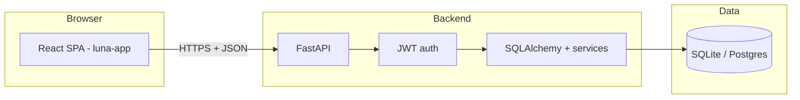

# Luna Platform — API for the Luna App

**Luna Platform** is the **FastAPI** service that powers **optional cloud mode** for [Luna](https://github.com/Lindsay522/luna-app): JWT auth, user-scoped **closet & outfits**, **wellness** logs (sleep, sport, mood, calendar events, focus sessions, outfit wear), **pandas-backed analytics**, and **rule-based recommendations**.

The **React client** lives in the separate repo **[Lindsay522/luna-app](https://github.com/Lindsay522/luna-app)** and talks to this API via `VITE_API_URL` (see that repo’s README).

---

## What reviewers should know

| Piece | Role |
|-------|------|
| **This folder** | `backend/` — run with Uvicorn; SQLite by default |
| **API prefix** | `/api/v1` (e.g. `/api/v1/health`, `/api/v1/docs`) |
| **Auth** | `POST /auth/register`, `POST /auth/login` → Bearer JWT |
| **Frontend** | Already integrated: TanStack Query + `fetch`, not axios |

---

## Architecture (high level)



More detail: [`docs/ARCHITECTURE.md`](docs/ARCHITECTURE.md) · Frontend wiring: [`docs/FRONTEND_INTEGRATION.md`](docs/FRONTEND_INTEGRATION.md).

---

## Repository layout

```
luna-platform/
├── README.md                 # This file
├── docs/
│   ├── ARCHITECTURE.md
│   ├── FRONTEND_INTEGRATION.md
│   └── IMPLEMENTATION_PLAN.md
└── backend/
    ├── app/
    │   ├── main.py           # FastAPI app + CORS + lifespan
    │   ├── api/routes/       # auth, closet, outfits, wellness, analytics
    │   ├── models/
    │   ├── schemas/
    │   ├── services/         # analytics (pandas), recommendations
    │   └── auth/
    ├── requirements.txt
    └── .env.example
```

---

## Quick start (backend only)

```bash
cd backend
python -m venv .venv

# Windows
.venv\Scripts\activate
# macOS / Linux
# source .venv/bin/activate

pip install -r requirements.txt
copy .env.example .env    # Windows — edit JWT_SECRET and CORS_ORIGINS
# cp .env.example .env    # Unix

uvicorn app.main:app --reload --host 127.0.0.1 --port 8000
```

- **Interactive docs:** [http://127.0.0.1:8000/docs](http://127.0.0.1:8000/docs)  
- **Health:** [http://127.0.0.1:8000/api/v1/health](http://127.0.0.1:8000/api/v1/health)

Default DB: **SQLite** file `./luna.db` (created on first run). Override with `DATABASE_URL` in `.env`.

---

## Environment variables (summary)

See **`backend/.env.example`** for full list. Important:

| Variable | Purpose |
|----------|---------|
| `DATABASE_URL` | `sqlite:///./luna.db` or Postgres URL |
| `JWT_SECRET` | **Change in production** |
| `CORS_ORIGINS` | Comma-separated; must include your SPA origin (e.g. `http://localhost:5173`, `https://lindsay522.github.io`) |

---

## API surface (v1)

| Area | Examples |
|------|----------|
| Auth | `/auth/register`, `/auth/login`, `/auth/me` |
| Wardrobe | `GET/POST /closet`, `DELETE /closet/{id}` |
| Outfits | `GET/POST /outfits`, `DELETE /outfits/{id}` |
| Wellness | `POST/GET /wellness/sleep`, `sport`, `POST /wellness/mood`, `POST/GET /wellness/events`, `DELETE /wellness/events/{id}`, `POST /wellness/focus-sessions`, `POST /wellness/outfit-worn` |
| Analytics | `GET /analytics/summary`, `GET /analytics/trends` |
| Recommendations | `GET /recommendations/outfits`, `/focus`, `/plan` |

---

## Roadmap (still optional)

| Phase | Ideas |
|-------|--------|
| Done in code | Auth, CRUD, analytics, recommendations v1, SQLite |
| Next | Alembic, Postgres in production, tests, stricter rate limits |
| Deploy | Render / Railway (API) + set `VITE_API_URL` on the static host |

Details: [`docs/IMPLEMENTATION_PLAN.md`](docs/IMPLEMENTATION_PLAN.md).

---

## License / attribution

Your project — keep **Luna / Lindsay** credit in the UI as you prefer.
