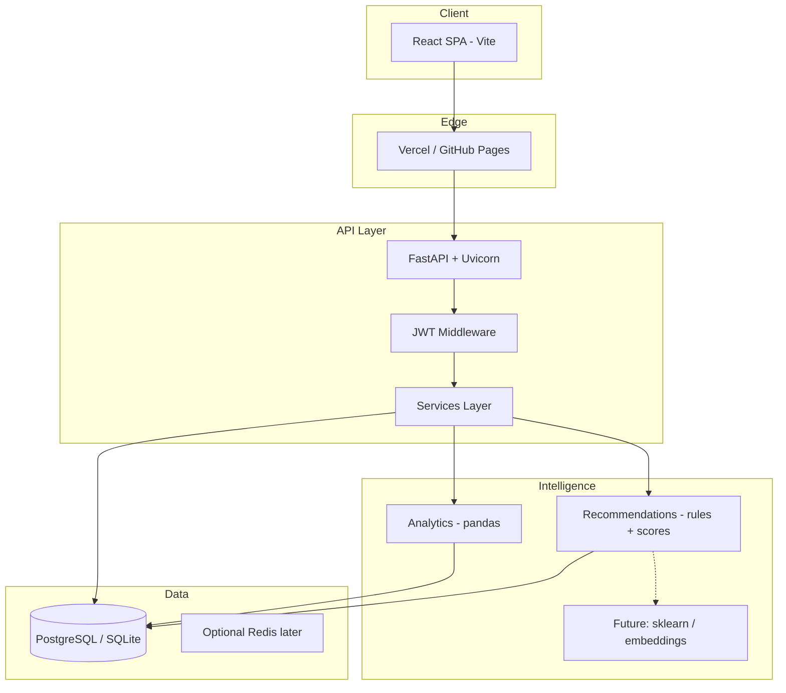

# Luna Platform — Full-Stack AI Lifestyle System

Research-grade evolution of **Luna App**: React frontend + **FastAPI** backend + **PostgreSQL/SQLite** + **analytics (pandas)** + **rule-based / scoring recommendations** + **JWT auth**.

## Live architecture (high level)



## Repository layout

```
luna-platform/
├── README.md                 # This file
├── docs/
│   └── ARCHITECTURE.md       # Deep dive + ERD + API conventions
├── backend/                  # FastAPI application
│   ├── app/
│   │   ├── main.py
│   │   ├── config.py
│   │   ├── database.py
│   │   ├── models/
│   │   ├── schemas/
│   │   ├── api/routes/
│   │   ├── services/        # analytics, recommendations
│   │   └── auth/
│   ├── requirements.txt
│   └── .env.example
└── frontend/                # Optional: git submodule or copy of luna-app
```

The existing **Luna App** UI lives in sibling folder `luna-app/` (React). Wire it to this API via `VITE_API_URL`.

## Quick start (backend)

```bash
cd backend
python -m venv .venv
.venv\Scripts\activate   # Windows
pip install -r requirements.txt
copy .env.example .env     # edit DATABASE_URL if needed
uvicorn app.main:app --reload --port 8000
```

- API docs: http://localhost:8000/docs  
- Health: http://localhost:8000/api/v1/health

## Implementation roadmap (phased)

| Phase | Scope |
|-------|--------|
| **P0** | Auth, user-scoped CRUD (closet, outfits, planner, wellness), SQLite, replace localStorage |
| **P1** | Wear logs + focus sessions + behavior events; pandas summaries; analytics API |
| **P2** | Recommendation engine v1 (rules + weighted scores); dashboard charts in React |
| **P3** | PostgreSQL + Alembic migrations; refresh tokens; rate limiting |
| **P4** | Deploy: Railway/Render (API), Vercel (frontend); optional lightweight ML (scikit-learn) |

Details: **docs/ARCHITECTURE.md**.

## Frontend integration (luna-app)

1. `npm install axios` (or keep `fetch`).  
2. `.env`: `VITE_API_URL=http://localhost:8000/api/v1`  
3. Store **access_token** in `sessionStorage` (or httpOnly cookie via future BFF).  
4. Replace `LunaProvider` localStorage calls with API hooks (`react-query` recommended).  
5. Add **Analytics** and **Recommendations** pages consuming new endpoints.

## Deployment (bonus)

| Layer | Suggestion |
|-------|------------|
| API | [Railway](https://railway.app) or [Render](https://render.com) — connect repo `backend/`, set `DATABASE_URL` (Postgres) |
| Web | [Vercel](https://vercel.com) — root `luna-app`, env `VITE_API_URL=https://your-api.onrender.com/api/v1` |
| DB | Railway/Render managed Postgres |

## License

Your project — retain Luna / Lindsay attribution as you prefer.
