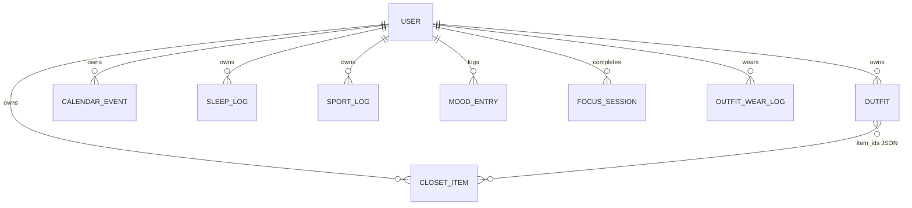

# Luna Platform — System Architecture

## 1. Design principles

- **Single source of truth**: all durable state in the database; frontend cache is optional.
- **Clear boundaries**: routers thin; **services** own analytics & recommendation logic.
- **Extensible intelligence**: v1 is explicit rules + linear scores; swap in ML without changing HTTP contracts.
- **Auditability**: timestamps on entities; optional `behavior_events` table for fine-grained logging.

## 2. Entity-relationship (logical)

## 3. API surface (`/api/v1`)

| Method | Path | Purpose |
|--------|------|---------|
| POST | `/auth/register` | Create user |
| POST | `/auth/login` | JWT access token |
| GET | `/auth/me` | Current user |
| CRUD | `/closet/*` | Wardrobe items |
| CRUD | `/outfits/*` | Outfits + items |
| CRUD | `/planner/events` | Calendar |
| CRUD | `/wellness/sleep`, `/sport`, `/mood` | Wellness |
| POST | `/behavior/focus-session` | Log focus timer |
| POST | `/behavior/outfit-worn` | Log outfit worn |
| GET | `/analytics/summary` | Dashboard aggregates (pandas) |
| GET | `/analytics/trends` | Weekly series |
| GET | `/recommendations/outfits` | Top-k outfit suggestions |
| GET | `/recommendations/focus` | Focus window hint |
| GET | `/recommendations/plan` | Plan nudge |

## 4. Recommendation v1 (scoring)

**Outfits**

- Features: occasion match, season alignment, tag Jaccard vs. recently worn, diversity penalty if over-worn.
- Score: weighted sum → normalize to `[0,1]` → return top 5 with explanations (for UI).

**Focus**

- If average sleep (7d) low → suggest shorter focus blocks; if mood “great” history → allow longer.
- Rule table extensible in `recommendation_service.py`.

**Plan**

- Based on event density per weekday from history → suggest “light day” template.

## 5. Analytics (pandas)

- Load user rows into DataFrames; `resample('W')` for weekly trends.
- Correlations: `sleep_hours` vs `focus_minutes` (Pearson), with sample-size guard (`n >= 7`).

## 6. Security

- Passwords: bcrypt via passlib.
- Tokens: JWT HS256; short TTL (e.g. 24h); refresh tokens in P3.
- CORS: restrict to frontend origin in production.

## 7. Inspiration (GitHub / industry patterns)

- **Strapi / Supabase-style** resource separation: one module per domain route file.
- **Netflix / Spotify**-style *explicit* recommendation reasons for portfolio narrative.
- **dbt** mindset: analytics as versioned transforms (here: service layer → later SQL views).
